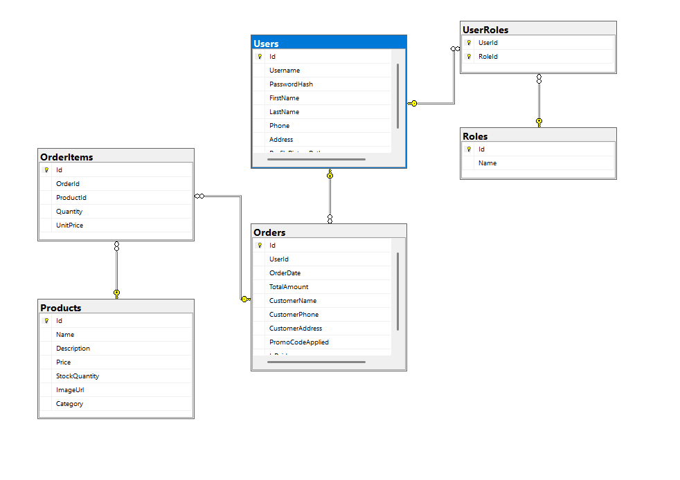

# ZooZen 🐾

ZooZen is a Windows Forms desktop application for managing a pet shop. Built as a diploma project for the System Programming specialization, it implements a three-layer architecture with a clean UI, business logic services, and an SQL Server database powered by Entity Framework Core.

## Tech Stack

| Technology | Version |
|---|---|
| C# / .NET | 8.0 |
| Windows Forms | .NET 8 |
| Entity Framework Core | 8.0.11 |
| SQL Server | 2019+ (or LocalDB) |

## Features

### User Management
- **Registration & Login** with role-based access control
- **Two Roles:** `Admin` and `Client`
- **Profile Management:** Edit personal info, address, and profile picture

### Product Catalog
- **Five Categories:** Animals, Food, Cosmetics, Accessories, Services & Promotions
- **Search & Filter** products by category
- **Stock Management:** Track and update inventory levels

### Shopping Cart & Orders
- **Dynamic Cart:** Add/remove products in real time
- **Checkout:** Enter name, phone, and delivery address
- **Promo Codes:** Apply discount codes at checkout
- **Order History:** Review past orders and download invoices

### Invoice Generation
- Generate a text invoice after a successful payment
- Export the invoice to a `.txt` file via a save dialog

### Admin Panel
- Full **CRUD** for products (name, price, stock, image, category)
- Full **CRUD** for users (view, edit role, delete)
- View all customer orders

## Architecture

The application follows a three-layer architecture:

```
┌──────────────────────────────────┐
│       Forms Layer (UI)           │  Windows Forms (.cs / .Designer.cs)
├──────────────────────────────────┤
│     Services Layer (Logic)       │  Interfaces + Implementations
├──────────────────────────────────┤
│      Data Layer (Database)       │  EF Core Models + DbContext
└──────────────────────────────────┘
```

### Project Structure

```
ZooZen/
├── Common/                  # Validation constants and error messages
├── DTOs/                    # Data Transfer Objects (User input/view models)
├── Extensions/              # Dependency Injection registration & ServiceLocator
├── Forms/                   # All Windows Forms (Login, Register, MainForm, etc.)
├── Migrations/              # Entity Framework database migrations
├── Models/                  # Domain entities, DbContext, and seed logic
│   ├── Enums/               # ProductCategory enum
│   └── DbConfiguration/     # ZooZenDbContext, Configuration, SeedAdmin
├── Scripts/                 # Database setup scripts (migrations.ps1, seed_data.sql)
├── Services/                # Business logic layer
│   └── Interfaces/          # Service contracts
├── Utilities/               # Helper classes (LayoutHelper, InvoiceHelper, etc.)
├── Program.cs               # Entry point – DI setup and application start
└── ZooZen.csproj
```

## Database Schema

| Entity | Key Fields |
|---|---|
| **User** | Id, Username, PasswordHash, FirstName, LastName, Phone, Address, ProfilePicturePath |
| **Role** | Id, Name (`Admin` \| `Client`) |
| **UserRole** | UserId (FK), RoleId (FK) — many-to-many join |
| **Product** | Id, Name, Description, Price, StockQuantity, ImageUrl, Category |
| **Order** | Id, UserId, OrderDate, TotalAmount, CustomerName, CustomerPhone, CustomerAddress, PromoCodeApplied, IsPaid |
| **OrderItem** | Id, OrderId, ProductId, Quantity, UnitPrice |

## Prerequisites

- [Visual Studio 2022](https://visualstudio.microsoft.com/) or later (with the **.NET desktop development** workload)
- [.NET 8.0 SDK](https://dotnet.microsoft.com/download/dotnet/8.0)
- [SQL Server](https://www.microsoft.com/en-us/sql-server/sql-server-downloads) (2019+, Express, or LocalDB)

## Getting Started

### 1. Clone the Repository

```bash
git clone https://github.com/DimitarTashkov/ZooZen.git
cd ZooZen
```

### 2. Configure the Database Connection

Edit `ZooZen/Models/DbConfiguration/Configuration.cs` and update the connection string to match your SQL Server instance:

```csharp
public static string ConnectionString =
    "Data Source=(localdb)\\MSSQLLocalDB;Initial Catalog=ZooZen;Integrated Security=True;";
```

### 3. Apply Database Migrations

**Using Visual Studio Package Manager Console:**

```powershell
Update-Database
```

**Using the .NET CLI:**

```bash
dotnet ef database update --project ZooZen
```

### 4. Seed Sample Data (Optional)

Run `ZooZen/Scripts/seed_data.sql` against your database in SQL Server Management Studio (SSMS) or Azure Data Studio to populate the catalog with 18 sample products.

### 5. Build & Run

```bash
dotnet build
dotnet run --project ZooZen
```

Or open `ZooZen.sln` in Visual Studio and press **F5**.

## Default Credentials

A default admin account is seeded automatically on first run:

| Field | Value |
|---|---|
| Username | `admin` |
| Password | `admin123` |

## Promo Codes

| Code | Discount |
|---|---|
| `ZOOZEN10` | 10% |

## Screenshots

### Login & Register


### App Pages


### Database Diagram


</details>
| `ZOOZEN20` | 20% |
| `PETLOVER` | 15% |

## Navigation

The main dashboard contains **five navigation menus**:

1. **Catalog** — All, Animals, Food, Cosmetics, Accessories
2. **Promotions & Services** — Service/promo product listings
3. **Cart** — Dynamic product list with checkout button
4. **My Profile** — Personal info and order history
5. **Administration** *(Admin only)* — Manage users and products

## Forms Overview

| Form | Purpose |
|---|---|
| `Login` | User login |
| `Register` | New user registration |
| `MainForm` | Dashboard with navigation menus |
| `CatalogForm` | Browse and search products |
| `CheckoutForm` | Cart review, promo codes, and payment |
| `AdminProductsForm` | CRUD interface for products |
| `AdminUsersForm` | CRUD interface for users |
| `ProfileForm` | View and edit user profile |
| `OrderHistoryForm` | View past orders |
| `ContactUsForm` | Contact information |
| `AboutUsForm` | About the application |

## License

This project was created as a diploma project for educational purposes.
